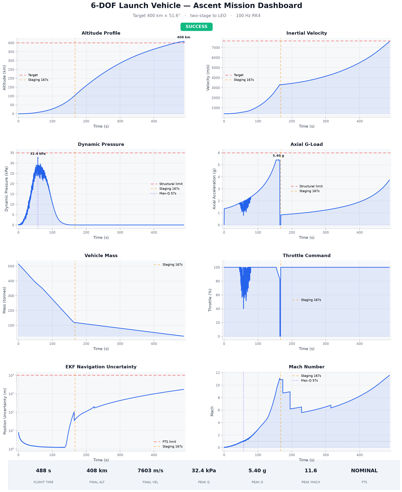
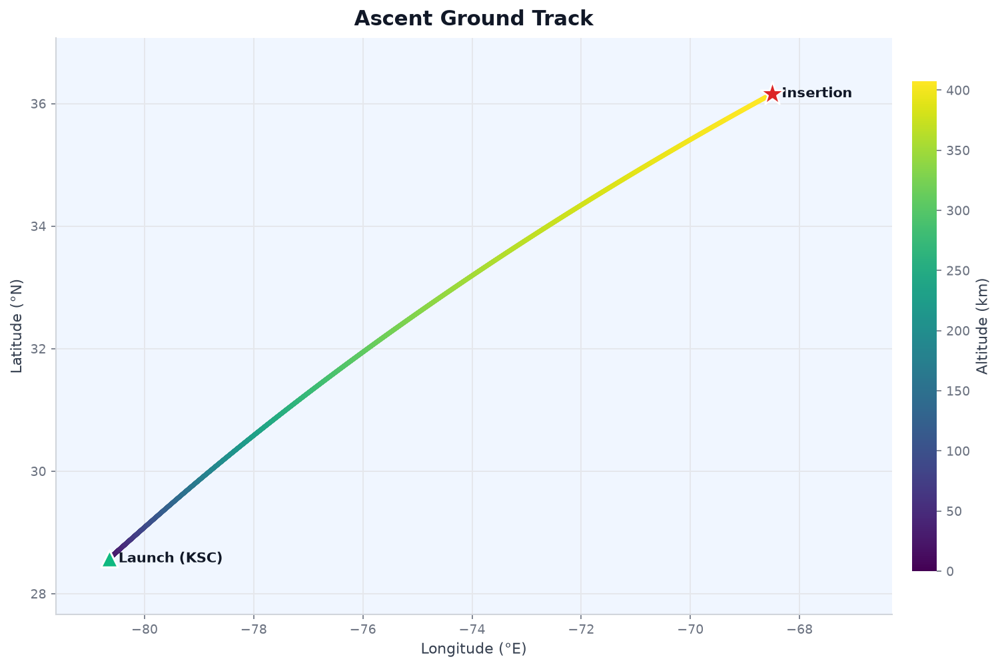

# 6-DOF Launch Vehicle Ascent Simulation

[](https://github.com/rmednitzer/6dof-ascent-sim/actions/workflows/ci.yml)
[](LICENSE)
[](https://www.python.org/downloads/)
[](https://github.com/astral-sh/ruff)
[](https://rmednitzer.github.io/6dof-ascent-sim/)
[](https://deepwiki.com/rmednitzer/6dof-ascent-sim)

A high-fidelity six-degree-of-freedom simulation of a two-stage orbital launch vehicle from ignition through LEO insertion.

📊 **[Project site & visual overview →](https://rmednitzer.github.io/6dof-ascent-sim/)**

## Features

- **6-DOF rigid body dynamics** with quaternion attitude representation (scalar-last `[x,y,z,w]`)
- **RK4 integration** at 100 Hz fixed timestep
- **WGS84 gravity model** with J2–J6 zonal harmonics (analytic geopotential gradient, verified to ~1e-10 vs a numerical gradient)
- **US Standard Atmosphere 1976** with altitude-dependent wind and gusts
- **Two-stage propulsion** with pressure-dependent thrust/Isp interpolation
- **Stage separation state machine** with safety interlocks
- **Three-phase guidance**: vertical rise, programmed gravity turn, PEG terminal guidance
- **PID attitude controller** producing TVC gimbal commands
- **15-error-state multiplicative EKF** estimating attitude, position, velocity, accel bias, and gyro bias (GPS + barometer + star-tracker aided, error-state quaternion)
- **Boundary enforcement** on all actuator commands and structural loads
- **Flight Termination System** with autonomous abort criteria
- **Structural dynamics**: flex-body bending modes (live in the control loop, stabilised by a frequency-scheduled structural notch filter) + propellant slosh (pendulum analogy)
- **Monte Carlo** dispersion analysis with multiprocessing (and an experimental [SLURM HPC backend](docs/hpc-slurm.md) for cluster-scale campaigns)
- **Telemetry recording** with SHA-256 integrity hashing
- **Post-flight analysis** with trajectory plots and orbit characterization

## Quick Start

```bash
pip install -e .
python -m sim.main
```

## CLI Options

```bash
python -m sim.main                 # Full simulation with flex + slosh
python -m sim.main --no-flex       # Disable flex body model
python -m sim.main --no-slosh      # Disable propellant slosh model
```

## Example: Run with Visualization

The `examples/` directory contains a standalone script that runs a nominal ascent and generates a visualization dashboard, ground track plot, and text summary:

```bash
python examples/run_and_visualize.py
python examples/run_and_visualize.py --no-flex --no-slosh
```

This produces three files in `examples/output/`:

| File | Description |
|---|---|
| `dashboard.png` | 8-panel mission dashboard (altitude, velocity, dynamic pressure, G-load, mass, throttle, EKF uncertainty, Mach) |
| `ground_track.png` | Latitude/longitude trajectory colored by altitude |
| `mission_summary.txt` | Plain-text report with key metrics and safety margins |

### Sample Output

**Mission Dashboard:**



**Ground Track:**



## Output

- `output/telemetry_internal.json` — Internal-rate (100 Hz) telemetry timeline
- `output/telemetry_downlink.json` — Downlink-rate telemetry timeline
- `output/mission_summary.json` — Mission summary with key metrics and SHA-256 integrity hash
- `output/plots/` — Trajectory visualization plots

## Monte Carlo

```bash
python -m sim.montecarlo.dispatcher --runs 1000 --workers 8   # single machine
```

For cluster-scale campaigns, an **experimental** SLURM backend distributes runs
across a job array and re-aggregates them into the same output schema (identical
results for a given base seed):

```bash
# Dry run: generate sbatch scripts without a cluster (nothing is submitted)
python -m sim.montecarlo.hpc submit --runs 5000 --runs-per-task 100 \
    --output-dir /scratch/$USER/mc1 --partition cpu --account proj

# On a SLURM login node, add --submit to launch the array + dependent collect job
```

See [docs/hpc-slurm.md](docs/hpc-slurm.md) for the full workflow.

## Configuration

All simulation parameters are in `sim/config.py` — single source of truth for orbital targets, vehicle specs, environment models, GNC gains, safety limits, and Monte Carlo settings.

## Development

```bash
pip install -e ".[dev]"        # Install with dev dependencies
pre-commit install              # Set up pre-commit hooks
```

## Tests

```bash
pytest tests/ -v                           # Run tests
pytest tests/ -v --cov=sim --cov-report=term-missing  # With coverage
```

## Project Structure

```
sim/
├── config.py              # All simulation parameters
├── main.py                # Main simulation loop
├── core/
│   ├── state.py           # VehicleState dataclass
│   ├── integrator.py      # RK4 integrator
│   └── reference_frames.py # ECI/ECEF/NED/Body transforms
├── environment/
│   ├── gravity.py         # WGS84 + J2 gravity
│   ├── atmosphere.py      # US Standard Atmosphere 1976
│   └── wind.py            # Wind profile + gusts
├── vehicle/
│   ├── vehicle.py         # Stage configuration + mass tracking
│   ├── propulsion.py      # Engine model with transients
│   ├── aerodynamics.py    # Mach-dependent drag
│   └── staging.py         # Separation state machine
├── dynamics/
│   ├── flex_body.py       # Bending mode dynamics
│   └── slosh.py           # Propellant slosh model
├── gnc/
│   ├── guidance.py        # Three-phase ascent guidance
│   ├── control.py         # PID attitude controller + TVC
│   ├── notch_filter.py    # Frequency-scheduled structural notch (flex coupling)
│   ├── sensors.py         # IMU/GPS/Baro/star-tracker sensor models
│   └── navigation.py      # 15-error-state EKF (attitude + pos/vel + IMU biases)
├── safety/
│   ├── boundary_enforcer.py # Command validation + clamping
│   ├── fts.py             # Flight Termination System
│   └── health_monitor.py  # Subsystem health tracking
├── telemetry/
│   ├── schemas.py         # TelemetryFrame + MissionSummary
│   └── recorder.py        # Telemetry recording + output
├── orbital/
│   ├── propagator.py      # Orbit elements + propagation
│   ├── maneuvers.py       # Correction budget estimation
│   └── decay.py           # Orbit decay estimation
├── montecarlo/
│   ├── dispersions.py     # Parameter dispersion definitions
│   ├── dispatcher.py      # Parallel run management (single machine)
│   ├── hpc.py             # Experimental SLURM cluster backend (job array)
│   └── statistics.py      # Result analysis + plots
└── analysis/
    └── postflight.py      # Post-flight trajectory plots
examples/
└── run_and_visualize.py   # Example run with dashboard visualization
```

## Documentation

- [Architecture](docs/architecture.md) — System design and data flow
- [Assumptions](docs/assumptions.md) — Modeling assumptions and simplifications
- [STPA Analysis](docs/stpa-analysis.md) — Safety analysis
- [Runbook](docs/runbook.md) — Operating procedures
- [SLURM HPC Monte Carlo](docs/hpc-slurm.md) — Cluster-scale dispersion campaigns (experimental)

## Contributing

See [CONTRIBUTING.md](CONTRIBUTING.md) for guidelines and [CODE_OF_CONDUCT.md](CODE_OF_CONDUCT.md) for community standards.

## License

See [LICENSE](LICENSE) for details.
